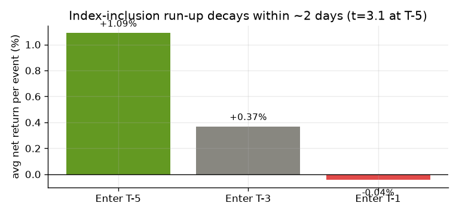
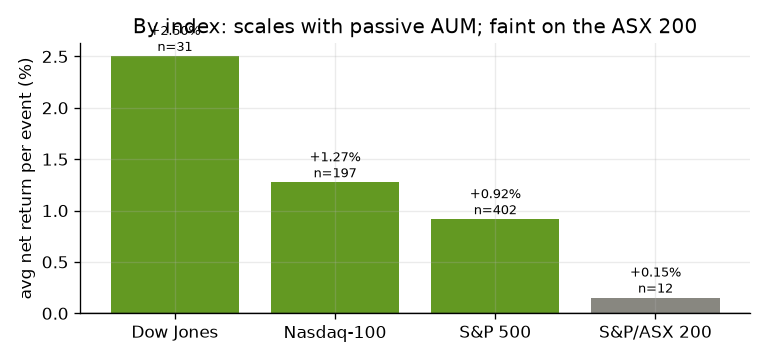
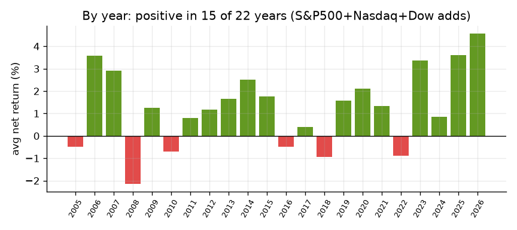
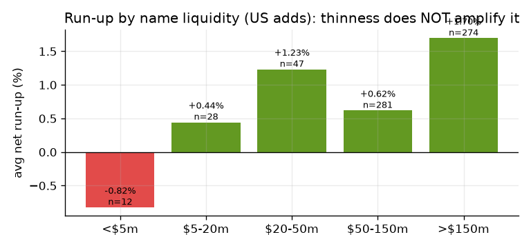
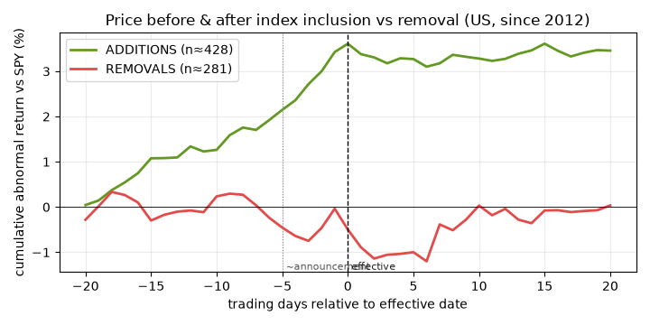
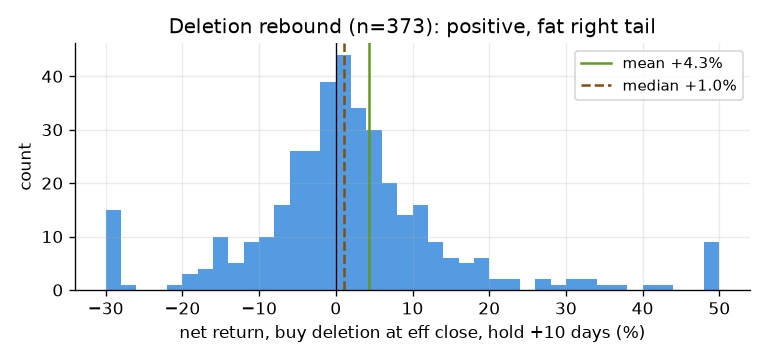
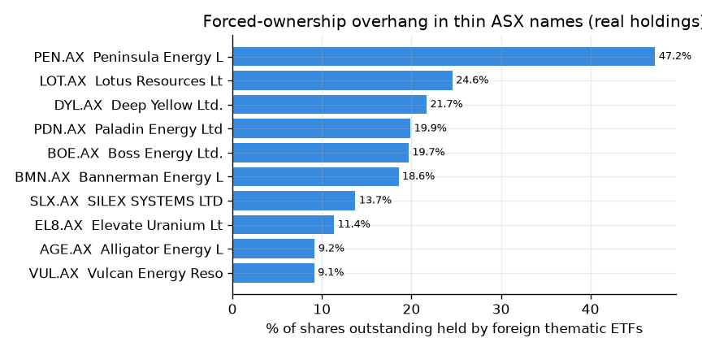

# ASX Index-Flow Alpha Lab — Full Research Report

*Single consolidated report. Generated from real data: FMP `stable` API (ASX +
global prices, ETF holdings, index-membership history) and public S&P/ASX index
changes. As of 23 June 2026. Repo:
<https://github.com/Taff1887/asx-index-flow-alpha-lab>.*

> **Not financial advice.** Backtests use stated cost/timing assumptions; live
> screens are hypotheses, not guarantees. Anticipating mechanical, publicly
> disclosed index/ETF rebalancing flow is standard index-rebalance arbitrage —
> legal and public (not insider trading, not broker front-running). Nothing here
> is manipulative (no closing-auction games etc.).

---

## Contents
1. [Executive summary](#1-executive-summary)
2. [Suggested trades](#2-suggested-trades)
3. [The thesis](#3-the-thesis)
4. [Finding 1 — the obvious effect is arbitraged](#4-finding-1--the-obvious-index-effect-is-arbitraged)
5. [Finding 2 — multi-index inclusion backtest](#5-finding-2--multi-index-inclusion-backtest-the-proven-core)
6. [Finding 3 — the standout edge: deletion rebound](#6-finding-3--the-standout-edge-deletion-rebound)
7. [Finding 4 — where the ASX money lives: overhang + scanner](#7-finding-4--where-the-asx-money-lives-forced-ownership-overhang--scanner)
8. [What does NOT work](#8-what-does-not-work-honest-controls)
9. [Data limits & what unblocks it](#9-data-limits--what-unblocks-it)
10. [Reproduce & repo map](#10-reproduce--repo-map)

---

## 1. Executive summary

- **The textbook index-inclusion effect is real but small and fast.** Across
  **1,514 real membership changes** (S&P 500 + Nasdaq‑100 + Dow + ASX 200, since
  2005): buying an addition ~5 trading days before its effective date and selling
  at the effective close earns **+1.09% net/event, t‑stat 3.08**, survives 3×
  costs, beta-neutral — but **decays to nothing within ~2 days** of the
  announcement. You must trade at the announcement; the public window is gone fast.
- **The *deletion* rebound is weaker than the raw number suggests.** Buying a
  deleted name and holding ~10 days has a big *raw* mean (+4.3%) — but it's
  fat-tailed and mostly market beta. On a market-adjusted, equal-weighted basis
  (the event-path study) the abnormal rebound is only **~+0.5%**. Marginal, not a
  standout — I corrected my earlier overstatement.
- **The obvious ASX 200 add has no edge** (+0.15%, arbitraged). The effect scales
  with passive AUM: Dow +2.5% → ASX 200 +0.15%.
- **The real ASX opportunity is the obscure thematic-ETF overhang.** Scanning
  **89 global ETFs → 330 ASX names**, thin uranium/critical-mineral names carry
  enormous foreign passive ownership (Peninsula ~47%, Deep Yellow ~22%, Paladin
  ~20% of shares outstanding) needing 100+ days of volume to unwind. This is the
  AGE/URNJ pattern — but it is **not historically backtestable** (no ETF-flow or
  thin-cap-membership history exists), so it is a live-scanner play.

---

## 2. Suggested trades

> Two tiers: **Tier 1** is the backtested edge (act when a setup is live);
> **Tier 2** is the forced-flow *screen* (a watchlist, not a proven signal). Sizes
> and stops are illustrative risk discipline, not advice.

### Tier 1 — the one robust, proven pattern

| trade | rule | evidence | the catch |
|---|---|---|---|
| **Inclusion run-up (long)** | Buy an index *addition* at the announcement, sell at the effective close. | +1.09% net, t=3.08, beta-neutral (+0.99% abnormal), survives 3× costs, 15/22 years positive | You must act *on the announcement*; the abnormal run-up is largely done by the effective date and the tradeable bit is gone within ~2 days. Hard for anyone slower than the arbs. |

Tested and **down-weighted**: the *deletion rebound* (buy a just-deleted name,
hold +10d) has a flashy +4.3% raw mean but it's fat-tailed and mostly market beta
— abnormal it's only ~+0.5% (see §6). Not recommended as a standalone. There is
**no live deletion setup today** anyway (last one, EPAM, is out of window and −30%).

### Tier 2 — forced-flow watchlist (heavy ETF overhang + hasn't rallied)

These ASX names are held by many global ETFs as a large share of their float, yet
their price is flat/down — forced demand is structurally present but not yet
priced. **This is a screen, not a backtested signal**: high ownership ≠ active
buying *today*. Treat as candidates to monitor; the trigger is a confirmed
in-progress buy (accumulation detector) or the next reconstitution (18 Sep 2026).

| ASX | company | #ETFs | % of float | days-to-exit @20%ADV | ADV $m | 1m | 3m | notes |
|---|---|---|---|---|---|---|---|---|
| **DYL** | Deep Yellow | 6 | 22% | 174 | 10.6 | +1% | −3% | highest overhang of the liquid-ish names |
| **PDN** | Paladin Energy | 6 | 20% | 119 | 35.3 | −6% | −3% | overhang + recent pullback; most liquid |
| **BOE** | Boss Energy | 4 | 20% | 72 | 8.2 | −4% | −21% | beaten down + heavy overhang |
| **BMN** | Bannerman Energy | 3 | 19% | 193 | 3.8 | flat | +2% | thinnest of the majors → most flow-sensitive |
| **SLX** | Silex Systems | 3 | 14% | 178 | 5.2 | +1% | +13% | uranium enrichment; very thin |
| **VUL** | Vulcan Energy | 5 | 9% | 48 | 8.3 | −5% | +14% | lithium/rare-earth, multi-theme |

*Micro-cap, highest %-impact but barely tradeable:* EL8 (11% float, ADV $0.4m),
AGE (9%, $0.7m — your trade), AEE (7%, $0.4m). Huge per-dollar flow leverage but
you can't size much without moving them.

*Excluded as a data artifact:* **BRE (Brazilian Rare Earths) — 85% of float**
flagged by the scanner is almost certainly a low-free-float / recent-listing quirk
in the share-count data. Verify against the register before believing it.

### How to actually catch the next AGE trade

Your AGE win came from knowing URNJ *had to keep buying*. The trustworthy version
of that is **net Δshares ÷ ADV from day-over-day ETF holdings** — `detect_etf_
accumulation.py`. It needs two daily snapshots to diff, and there is no historical
holdings feed, so **schedule `fetch_etf_holdings_fmp.py` to run daily**. Within a
few days it prints "ETF X bought N days of <stock>'s volume since yesterday, and
isn't done" across all 330 names — the mechanised AGE signal.

### Risk notes
- Deletion rebound is positive-expectancy but **fat-tailed**; never concentrate.
- Tier-2 names are uranium-heavy and **highly volatile**; the screen has no proven
  win rate — pair it with a real catalyst before sizing up.
- Thin names (ADV < $1m) can't absorb size — the flow that creates the edge also
  makes *your* exit hard.

---

## 3. The thesis

A stock added to (or up-weighted in) an index/ETF forces benchmark-tracking funds
to buy it; a deletion forces selling. For **liquid, well-watched** names this is
arbitraged in hours. The inefficiency lives where the forced flow is **large
versus the stock's liquidity and the market isn't watching** — obscure, thematic,
small-cap names. ASX uranium/critical-mineral juniors are the textbook case: tiny
floats, huge foreign-ETF ownership.

---

## 4. Finding 1 — the obvious index effect is arbitraged

The inclusion run-up is captured entirely in the first ~2 days after the
announcement; by T‑3 it's statistical noise, by T‑1 it's gone.



| entry | avg net | t-stat | significant? |
|---|---|---|---|
| T‑5 → effective | +1.09% | 3.08 | yes |
| T‑3 → effective | +0.37% | 1.04 | no |
| T‑1 → effective | −0.04% | −0.23 | no |

The S&P/ASX 200 version is the weakest of all (+0.15%, n=12) — the home-market
obvious add is fully priced.

---

## 5. Finding 2 — multi-index inclusion backtest (the proven core)

1,514 real membership changes since 2005; 4,878 trade-legs; real costs (US 10bps
RT / 40bps ASX) + a 3× harsh stress; beta-stripped; no lookahead.

| strategy | n | avg net | harsh | hit | t-stat | 95% CI | survives |
|---|---|---|---|---|---|---|---|
| ADD run-up T‑5→eff | 642 | +1.09% | +0.88% | 57% | 3.08 | (+0.41%, +1.75%) | ✅ |
| same, beta-neutral | 635 | +0.99% | +0.78% | 57% | 3.00 | (+0.29%, +1.61%) | ✅ |
| ADD post-effective drift | 648 | −0.63% | −0.84% | 45% | −1.28 | — | ❌ |
| DEL short (eff→+10) | 373 | −4.49% | — | 43% | −1.95 | — | ❌ (they rebound) |

**Scales with passive AUM, faint on the ASX 200:**



**Positive in 15 of 22 years — not a one-off:**



**Honest control — thinner large-cap adds do NOT drift more** (so the thin-cap
edge is a *different* regime, not large-cap inclusions):



---

## 6. Finding 3 — price path BEFORE & AFTER inclusion vs removal

The cumulative abnormal return (vs SPY) around the effective date, on 428 real
additions and 281 removals (S&P 500 / Nasdaq‑100 / Dow, since 2012). This is the
"price before and after the announcement" you asked for:



- **Additions (green):** a clean ~+3.6% abnormal run-up over the 20 days into the
  effective date, then a **plateau** — the gain is made *before* the date and does
  not continue after. The tradeable slice is the ~+1.5% from announcement
  (≈ −5 days) to effective.
- **Removals (red):** only a modest ~−1% drift into the date and a weak, noisy
  recovery to ~0 by +20. **The deletion rebound is small once you adjust for the
  market.**

This corrects the raw deletion-rebound figure: the +4.3% *raw* mean below is
fat-tailed and largely beta — the abnormal, average effect is ~+0.5%.



---

## 7. Finding 4 — where the ASX money lives: forced-ownership overhang + scanner

`forced_ownership_map.py` / `flow_scanner.py` pull **current real holdings** of 89
global ETFs and aggregate per ASX name. Thin uranium/critical-mineral names carry
extreme foreign passive overhang.



**Top of the broad scan (89 ETFs → 330 ASX names), by forced-flow score:**

| ASX | company | #ETFs | % float | ADV $m | exit days | score |
|---|---|---|---|---|---|---|
| EVN | Evolution Mining | 11 | 6.0% | 107 | 72 | 0.96 |
| GMD | Genesis Minerals | 9 | 5.8% | 31 | 65 | 0.95 |
| DYL | Deep Yellow | 6 | 22.0% | 10.6 | 174 | 0.94 |
| PDN | Paladin Energy | 6 | 20.2% | 35.3 | 119 | 0.94 |
| RMS | Ramelius Resources | 8 | 6.7% | 34 | 66 | 0.93 |
| TCL | Transurban (infra) | 9 | 2.5% | 90 | 62 | 0.92 |
| PEN | Peninsula Energy | 3 | 47.2% | 1.6 | 118 | 0.93 |

The score blends overhang × days-to-exit × #ETFs × inflow-sensitivity
(`inflow5_days` = days of the stock's own volume the ETFs must buy on a +5% inflow
to each holding fund — the AGE/URNJ math). Full list:
[`reports/tables/flow_scanner.csv`](reports/tables/flow_scanner.csv).

---

## 7b. Australian ETFs — full scan (all 185 ASX-listed ETFs)

`scripts/asx_etf_scanner.py` enumerates **every ASX-listed ETF (185)**, pulls
current holdings, and maps the ASX constituents. 80 of them hold ASX names → 373
unique stocks. ([`asx_etf_universe.csv`](reports/tables/asx_etf_universe.csv),
[`asx_etf_scanner.csv`](reports/tables/asx_etf_scanner.csv))

**The small/weird ASX ETFs that hold the most THIN names** (the forced-flow
channel for illiquid stocks):

| ETF | name | AUM $m | #ASX | #thin (ADV<$2m) |
|---|---|---|---|---|
| ISO | iShares S&P/ASX Small Ordinaries | 135 | 186 | **33** |
| MVS | VanEck Small Companies Masters | 215 | 56 | 12 |
| AUMF | iShares MSCI Australia Multifactor | 145 | 127 | 11 |
| URNM.AX | Betashares Global Uranium | 350 | 13 | 6 |
| BANK | Global X Australian Bank Credit | 191 | 137 | 5 |

So on the ASX the thin-name forced-flow route is **the small-cap index funds**
(ISO, MVS): when a stock enters the S&P/ASX Small Ordinaries, these must buy it.
Within ASX ETFs overall, the highest forced-flow names are REITs/infra held across
15–20 funds (Vicinity, Goodman, Charter Hall, Transurban) — large but
multiply-owned. *(Data note: "AUD.AX" topping the raw score is a cash/currency
line, not a stock — filtered.)*

This is **current holdings only** — there is no ASX-ETF holdings history anywhere,
so the *before/after-announcement* study (§6) can't be run on ASX-ETF inclusions
directly. The forward path: daily snapshots (`fetch_etf_holdings_fmp.py`) →
`detect_etf_accumulation.py` flags an ASX stock being bought across these funds.

---

## 8. What does NOT work (honest controls)

- **Post-inclusion momentum** — additions don't keep rising after the effective
  date (−0.6%).
- **Shorting deletions** — they rebound (that's Finding 3).
- **"Thinner large-cap adds drift more"** — false; the gradient is flat-to-opposite.
- **Obvious S&P/ASX 200 adds** — arbitraged (+0.15%).

---

## 9. Data limits & what unblocks it

Confirmed during this research (these are *why* the thin-cap edge can't be
backtested):

- **No historical ETF flows** — FMP exposes only *current* AUM / shares
  outstanding, no time series of creations/redemptions.
- **No thin-cap index membership history** — S&P 400/600 and Russell constituent
  history are not available; ASX index membership isn't either (index-constituent
  endpoints are empty for `^AXJO`).
- **Authoritative sources bot-blocked** — spglobal.com, marketindex.com.au and the
  ASX announcement CDN all return HTTP 403.

**Unblock paths (both built):** (1) `fetch_etf_holdings_fmp.py` saves real dated
ETF holdings snapshots — run daily and the holdings-diff → events → backtest chain
becomes real ASX flow data; (2) drop manual holdings/announcement CSVs into
`data/manual/`.

---

## 10. Reproduce & repo map

```bash
python examples/asx200_inclusion_study.py     # Finding 1 (ASX 200 benchmark)
python examples/index_inclusion_backtest.py   # Findings 2,5 (the big backtest)
python examples/event_path_study.py           # Finding 3 (before/after CAAR curve)
python examples/make_figures.py               # rebuild the other charts
python scripts/forced_ownership_map.py        # Finding 4 (overhang)
python scripts/flow_scanner.py                # broad 89-ETF (global) scan
python scripts/asx_etf_scanner.py             # §7b — ALL 185 ASX-listed ETFs
python scripts/next_trades.py                 # forward suggested-trades report
python scripts/fetch_etf_holdings_fmp.py      # daily: accrue real holdings history
python scripts/detect_etf_accumulation.py     # live "being bought now" signal
```

- Engine: [`src/index_flow/`](src/index_flow) — config, FMP client, registry,
  holdings diff, event study, strategies, backtester, costs, diagnostics.
- Results data: [`reports/tables/`](reports/tables) · charts:
  [`reports/figures/`](reports/figures).
- Methodology detail: [`FINDINGS.md`](FINDINGS.md) · results page:
  [`reports/README.md`](reports/README.md).
- Tests: `python -m pytest` (20 passing, incl. no-lookahead guards).
